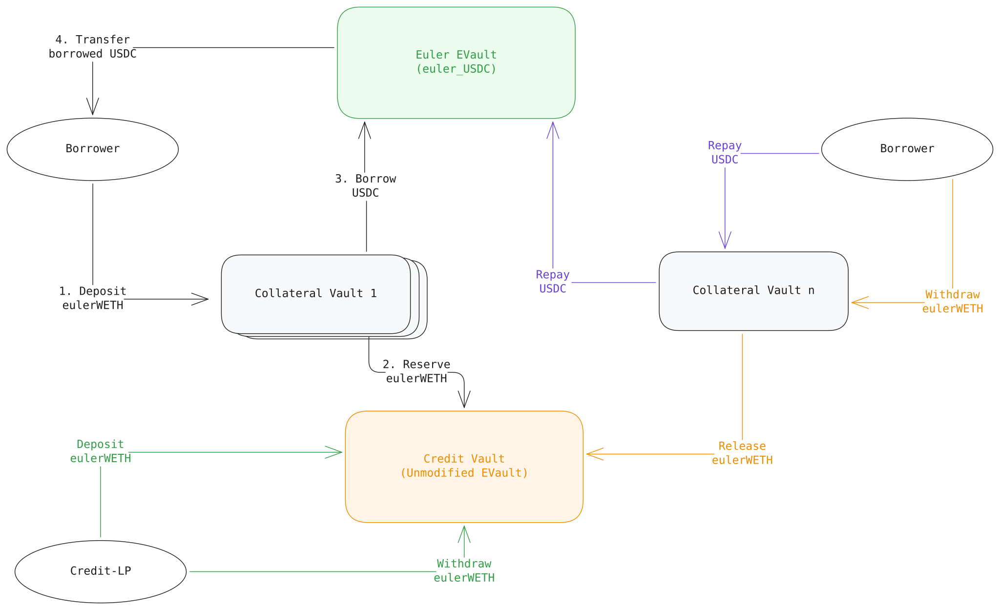

# Contracts

<figure><picture><source srcset="../../.gitbook/assets/contracts5.svg" media="(prefers-color-scheme: dark)"></picture><figcaption>
<em>Multiple such systems can operate independently</em>
</figcaption></figure>

## Intermediate (Credit) Vault 

* Deployed by the Twyne team, one per (collateral asset, external lending market) pair.
* Unmodified Euler EVault based on [EVK](https://github.com/euler-xyz/euler-vault-kit), so it has a single asset that can be lent and borrowed. That asset is a receipt token from the underlying lending market — for instance:
  * an `aWETHWrapper` token (a Twyne-maintained ERC20 wrapper around Aave's `aWETH`) for the Aave V3 integration, or
  * `eWETH` for the Euler V2 integration.
* Only collateral vaults can borrow from the intermediate vault — Credit-LPs deposit and withdraw freely but cannot be borrowers.

## Collateral Vault 

* Deployed by the borrower through `CollateralVaultFactory.createCollateralVault(...)`, one per position.
* At deployment, the borrower picks the `VaultType` (`AAVE_V3` or `EULER_V2`), intermediate vault, target (external) vault, liquidation LTV, and — for Aave V3 — the target asset to borrow.
* The factory then:
  1. validates the requested `(intermediate vault, target vault, targetAsset)` combination is whitelisted in `VaultManager`;
  2. deploys a `BeaconProxy` whose implementation is keyed on target vault address;
  3. initializes the collateral vault;
  4. calls `VaultManager.setLTV(...)` so the newly deployed collateral vault can borrow from its intermediate vault using its own shares as collateral;
  5. configures the oracle router so that the collateral vault can be priced through its `convertToAssets()` pass-through.
* Each collateral vault has exactly one borrower at a time, but a borrower may own many collateral vaults. If a collateral vault is internally liquidated, the liquidator becomes the new borrower.

## **Terminology**

* **Borrow / repay** (standalone) — always refers to borrowing/repaying debt against the external lending market (Aave, Euler, …).
* **Reserve / release** — always refers to borrowing/repaying credit from/to the intermediate vault. Reserving pulls CLP credit into the collateral vault; releasing returns it.
* **Target asset** — the asset the collateral vault borrows from the external lending market (e.g. USDC).
* **Target vault** — the vault from which the collateral vault borrows from (e.g. Aave pool, eulerUSDC).
* **Collateral asset** — the receipt token the collateral vault uses as collateral (e.g. `aWETHWrapper`, `eWETH`).

A collateral vault lets its borrower deposit/withdraw collateral, reserve/release credit from the intermediate vault, and borrow/repay target asset from the external lending protocol.
